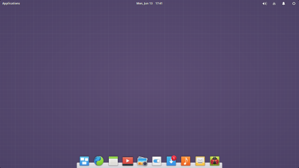

# elementary OS Twi Translation Guide

This is an effort to translate [elementary OS](https://elementary.io), a computer operating system, to Twi (Akan) which is commonly spoken in Ghana. This will hopefully make it easily accessible to the many locals who can only read or speak Twi.

You may read this [this blog](https://aberba.com/2020/translating-elementary-os-to-twi/) to learn more about why this is important. 

You can [contact me](https://github.com/aberba) if you would like to help out.

> I have made a [YouTube video](https://www.youtube.com/playlist?list=PL6M5AjwPmqHgx72Dgue4Hcb4dpnKfHbxV) on how to contribute if you prefere video form.

## Getting Started with the translation process
Make sure you are well fairly good in speaking, reading and writing Twi to be able to qualify for this task.

Also, it'll help to be familiar with basic terminologies like `Copy`, `Delete`, `Internet`, `Software`, `Hardware`, `Operating System`, `Computer Programming`, `Download` and several others commonly used when dealing with computers. This is important since software translation can be a little technical. The sentences and phrases you will be translating requires that **you know what they mean practically**.

With these in mind, here's how to get started in two easy steps:
1. Read the [elementary OS tranlation guide](https://elementary.io/docs/translation-guide#translation-guide) to familirarize yourself with the translation process.
2. Visit the elementary OS translation website, create an account, and start translating.

I have made a [YouTube video](https://www.youtube.com/playlist?list=PL6M5AjwPmqHgx72Dgue4Hcb4dpnKfHbxV) on how to do this as well.

### How to be a good translator
* Do not do direct translation. Make sure your translation reads natural and easy understandable.
* Try your best to make translations phrases either less or equal to the length of the English version without loosing meaning and context.

## Language Properties

Item  | Property
-- | -- |
Language Name | Akan
Country of origin | Ghana, Also spoken in some parts of Togo and Cote D'voire
ISO 300 Code | aka 
Plural Forms | nplurals=2; plural=(n > 1);

## List of Akan Characters.

Uppercase | Lowercase | Example words 
-- | -- | -- |
Ɛ | ɛ | Ɛdin, Intanɛt
n/a | έ | ...
Ɔ | ɔ | Ɔgya
… | … | Bue wɔ …
à | ã | Fã, Mã
n/a | á | Ná
... | é | v
Ũ | ũ | Mũ
... | õ | v
® | ... | ® Adwuma LTD.

## List of common terms and their Akan translations

Each term has a marker such as **_(v)_**, **_(n)_**, **_(adj)_** indicating the term is either a **_nouns_**, **_verb_**, **_adjective_** respectively.

English | Akan Singular  | Akan Plural  | Used in sentence or phrase 
-- | -- | -- | -- |
Internet (n) | Intanɛt | ... | Kɔ `Intanɛt` so
Software (n) | Dwumadie | Dwumadie Ahoroɔ | Bue computer so `dwumadie` bi | This is in the context of computers as opposed to an event/occasion
Copy (v) | Fa bi | ... | `Fa` file no bi |
Cut (v) | Fa | ... | `Fa bi` kɔ baabi foforɔ 
Delete (v) | Yi | ... | `Yi` file fi computer no so 
Paste (v) | Fa to ha | ... | `Fa` file no `to ha` (paste file here) | Avoid direct trasn])
Information (n) | Nsɛm | Nsɛm Ahoroɔ | Hwɛ file no ho `nsɛm` 
Translation (n) | nkyerɛase | Nsɛm Ahoroɔ | Hwɛ file no ho `nsɛm` 
Library (n) | Nhomakorabea | Nhomakorabea | ...
Color (n) | Mmuae | Mmuae | ...